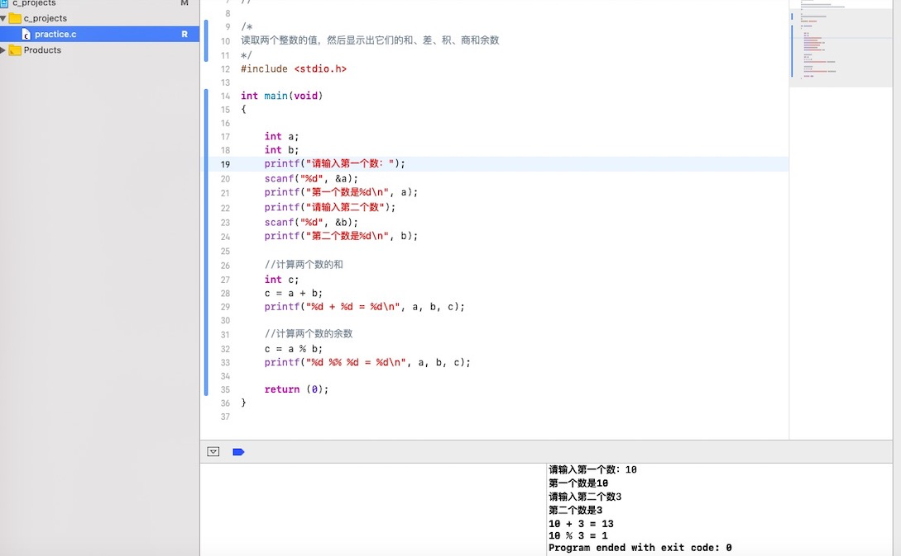

# **xcode用法3.18**

## **xcode执行界面截图：**



## Xcode Project**

Xcode中的 project里面包含了所有的源文件，资源文件和构建一个或者多个product的信息。project利用他们去编译我们所需的product，也帮我们组织它们之间的关系。一个project可以包含一个或者多个target。project定义了一些基本的编译设置，每个target都继承了project的默认设置，每个target可以通过重新设置target的编译选项来定义自己的特殊编译选项。

project包含了以下信息：

- 源文件
  - 代码的头文件和实现文件
  - 静态库，动态库，
  - 资源文件（如文本，xml，plist等）
  - 图片资源
  - 界面资源文件（xib， storyboard等）
- 在文件结构的导航中，采用group去组织文件（实际开发中，尽量使用实体文件夹）
- project的编译级别配置文件如（debug， release）
- target
- 运行环境如：debug，test

project可以单独存在，或者存在于一个workspace中。

## **target**

target定义了构造一个product所需的文件和编译指令。一个target对应于一个product。target说白了就是
 告诉编译系统要编译的文件和编译设置。编译指令就是根据build settings and build phases来确定的。

target之间可以进行依赖。如果一个target的编译需要另外一个target作为他的输入，那么我们就可以说前者依赖于后者。如果这两个target在同一个workspace里面，Xcode可以发现他们的依赖关系，这种依赖称之为隐式依赖。当然你可以通过设置，明确他们的依赖关系。

## **workspace**

workspace是Xcode的一种文件，用来管理工程和里面的文件，一个workspace可以包含若干个工程，甚至可以添加任何你想添加的文件。workspace提供了工程和工程里面的target之间隐式和显式依赖
 关系，用来管理和组织工程里面的所有文件。


### workspace中的工程共享一个编译目录

workspace中的工程默认都是在同一个编译目录下，也就是workspace的编译目录。由于每个工程中的文件都在workspace的编译目录下，所以每个工程之间的文件都是相互可以引用的。因此，如果workspace中的多个工程使用了同一个库的时候，我们就不需要给每个工程都拷贝一个。

workspace中每个工程依然都是独立的。如果你想单独的使用这个工程，并且不希望影响其他工程，或者被其他工程影响，你可以直接打开工程而不通过workspace。一个工程可以被多个workspace所拥有，在任意的组合中依然可以直接运行，而不需要去重新配置工程或者workspace。

## **Xcode Scheme**

scheme定义了编译集合中的若干target，编译时的一些设置以及要执行的测试集合。我们可以定义多个scheme，但是每次只能使用其中一个。我们可以设置scheme保存在project中还是workspace中。如果保存在project中，那么任意包含了这个工程的workspace都可以使用。如果保存在workspace中，那么只有这个workspace可以使用。

## **Project和Target关系：**

- Project是一个工程项目，一个Project可以包含多个Target，Target之间互相没有关系，Target于Project的关系是：Target的Setting一部分继承自Project的Setting

  当需要运行某个cpp文件时，要在选择`target`选择对应的`target`，然后`command+R`运行

## **.h和.m文件分别是什么**

.h 表示头文件，用来声明各种成员变量，方法，属性之类的。在import的时候用头文件。

.m 主要用来实现.h 里声明的方法。举个例子，如果要写一个方法，你要在.h里先声明：

 `void）myMethod ; `
然后在.m 里具体实现：

 ```c
(void) myMethod { 
NSLog(@"This is my new method");
    }
 ```

  

# **继续学习vim基本操作：**


|               命令                |                           作用                           |
| :-------------------------------: | :------------------------------------------------------: |
|             u（小写）             |                 撤消最后执行的(一次)命令                 |
|             U（大写）             |                     撤消对整行的修改                     |
|            多次输入 u             |                     撤消 更前的命令                      |
|           次输入 CTRL-R           |                       取消撤销动作                       |
|               dd+p                | 整行删除(将该行保存到 Vim 的一个寄存器中)+将该行粘贴置入 |
|                dw                 |        删除从当前光标当前位置直到下一个单词起始处        |
|                d$                 |              从当前光标当前位置直到当前行末              |
|              CTRL-G               |            显示光标所在行位置以及文件状态信息            |
|               /adf                |                 从光标处往下查查找“adf”                  |
|         光标放在“{”处，%          |                    查找与之匹配的"}"                     |
| :!ls （所有外部命令都可用:!执行） |        跳出到mac终端输入ls命令，按回车回到vim界面        |

### **明天开始学习plantUML基本写法**  


