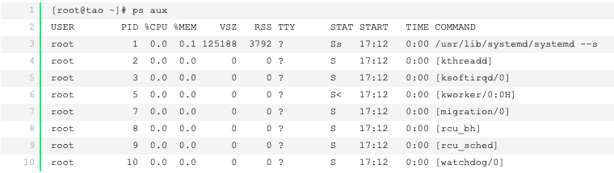
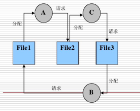
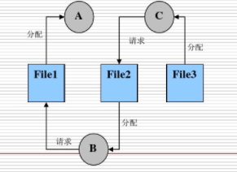

# **作业&笔记3.25**

## **Linux ps与top命令**

这两个命令都是查看系统进程信息的命令，但是用处有点儿不同

**1.ps命令--提供系统过去信息的一次性快照**

也就是说ps命令能够查看刚刚系统的进程信息，命令：ps aux或者ps lax

解释如下：

VSZ--进程的虚拟内存大小

RSS--驻留集的大小，可以理解为内存中页的数量

TTY--控制终端的ID

STAT--也就是当前进程的状态，其中S-睡眠，s-表示该进程是会话的先导进程，N-表示进程拥有比普通优先级更低的优先级，R-正在运行，D-短期等待，Z-僵死进程，T-被跟踪或者被停止等等

STRAT--这个很简单，就是该进程启动的时间

TIME--进程已经消耗的CPU时间，注意是消耗CPU的时间

COMMOND--命令的名称和参数

**ps lax 可以看到父进程，谦让值以及该进程正在等待的资源等待**

**ps aux 查看系统所有进程数据(静态) USER:该进程属于哪个用户账号的；**

**2.top命令反应的是系统进程动态信息，默认10s更新一次**

顶部始终显示的是系统**当前最活跃**的进程，此时还可以接受用户的键盘输入向进程发送信号等待

ps和top都是从/proc目录下读取进程的状态信息，内核把当前系统进程的各种有用信息都放在这个伪目录下。

## **作业一：**

### **复习题**

8. **在周末，Alice经常要通过她的笔记本电脑访问保存在办公室台式机上的文件。上周她在办公室台式机上安装了一个FTP服务器程序的副本，在家里的笔记本电脑上安装了FTP客户机程序的副本。她很失望周末无法访问到她的文件。这可能出现什么差错了?**

   局域网没有外网ip

9. **大多数安装在个人计算机上的操作系统带有几个客户端进程，但通常没有服务器进程，请解释原因。**

   因为个人计算机通常不用作服务器，服务器有专门的服务器操作系统

### **练习题**

3. **假设连接到因特网的主机在2010年是5亿台。这个数字以每年20%的速度增长，到2020年主机数量是多少?**

   5*1.210=30.95亿

9. **比较16位端口地址(0〜65535)和32位IP地址(0〜4294967295)的范围，为什么我们需要IP地址有如此大的范围，但端口号却相对范围小呢?**

   端口地址是标识一台计算机的通讯的进程的 IP地址是标识全球计算机的，用于寻址的

**补充题：解释浏览器输入 www.baidu.com并回车到底发生了些什么？**

**第一步：浏览器输入域名**

例如输入：www.baidu.com

**第二步：浏览器查找域名的IP地址**

若是第一次访问的网站，ISP的DNS服务器就会进行递归查询，所谓递归查询就是如果主机所询问的本地域名服务器不知道被查询域名的IP地址，那么本地域名服务器就以DNS客户的身份，向其他根域名服务器继续发出查询请求报文，而不是让该主机自己进行下一步查询。

**第三步 ：浏览器与目标服务器建立TCP连接**

1.主机浏览器通过DNS解析得到了目标服务器的IP地址后，与服务器建立TCP连接。

2.TCP3次握手连接：浏览器所在的客户机向服务器发出连接请求报文（SYN标志为1）；服务器接收报文后，同意建立连接，向客户机发出确认报文（SYN，ACK标志位均为1）；客户机接收到确认报文后，再次向服务器发出报文，确认已接收到确认报文；此处客户机与服务器之间的TCP连接建立完成，开始通信。

**第四步：浏览器通过http协议发送请求**

浏览器向主机发起一个HTTP-GET方法报文请求。请求中包含访问的URL，也就是http://www.baidu.com/ ,KeepAlive，长连接，还有User-Agent用户浏览器操作系统信息，编码等。

**第五步：服务器处理请求**

服务器接收到获取请求，然后处理并返回一个响应。

**第六步：服务器发出一个HTML响应**

服务器可以响应请求，返回报文，由于在报头中Content-type为“text/html”，浏览器以HTML形式呈现，而不是下载文件。

**第七步：释放TCP连接**

1.浏览器所在主机向服务器发出连接释放报文，然后停止发送数据；

2.服务器接收到释放报文后发出确认报文，然后将服务器上未传送完的数据发送完；

3.服务器数据传输完毕后，向客户机发送连接释放报文；

4.客户机接收到报文后，发出确认，然后等待一段时间后，释放TCP连接；

**第八步：浏览器显示页面**

在浏览器没有完整接受全部HTML文档时，它就已经开始显示这个页面了，浏览器接收到返回的数据包，根据浏览器的渲染机制对相应的数据进行渲染。渲染后的数据，进行相应的页面呈现和脚步的交互。

**第九步：浏览器发送获取嵌入在HTML中的其他内容**

比如一些样式文件，图片url，js文件url等，浏览器会通过这些url重新发送请求，请求过程依然是HTML读取类似的过程，查询域名，发送请求，重定向等。

## **作业二**

### **复习题**

9. **为什么操作系统需要队列?**

   有很多的作业和进程相互竞争计算机资源。例如，当一些作业进入内存时，其他的就必须等待直到有了可用空间。或者当一个进程正在使用CPU时，其他进程就必须等待直到CPU空闲为止。为处理多个进程和作业，进程管理器使用队列

10. **死锁和饿死有何区别?**

    当操作系统没有对进程的资源进行限制时将会发生**死锁**。

    **饿死**是一种与死锁相反的情况。它发生在当操作系统对进程分配资源有太多限制的时候。

### **练习题**

9. 三个进程(A、B和C)同时运行，进程A占用File1但需要File2。进程B占用File3但需要File1。进程C占用File2但需要File3。为这几个进程画一个框图。这种情况是不是死锁?

   

是死锁

10. 三个进程(A、B和C)同时运行，进程A占有File1，进程B占有File2但需要File1,进程C占有File3但需要File2。为这几个进程画一个框图。这种情况是不是死锁?如果不是，说明进程怎样最后完成它们的任务。

不是死锁，进程A先被执行并释放File1，接着进程B被执行并释放file2，进程C被执行释放file3