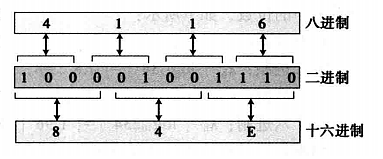
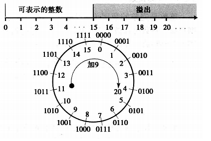

# **数字系统&数字存储预习3.20**

## **数码的数量**

通过k=[logbN]的关系，我们总可以找到一个整数的数码的数量，其中[x]意味着最小的整数大于或等于x(这也称为x的高限)，N是该整数的十进制值。例如，我们可以找到十进制数234在所有4个系统中的位数，如下所示:

a. 十进制: kd = [log10234] = [2.37] = 3，显而易见。
b. 二进制：kb = [log2234] = [7.8] = 8，因为234 = (11101010)2，所以正确。

## **二进制一十六进制的转换**

在这两个底之间存在一种关系二进制中的4位恰好是十六进制中的1位。

下面演示如何将二进制数(10011100010)2转换为十六进制数。
**解** 我们先将二进制数排为4位一组的形式 100 1110 0010 。注意最左边一组可能是1到4位不等。我们根据表2-2所示的值对照每组等量转换得到十六进制数(4E2)16。

## **八进制 -- 十六进制的转换**

- 从八进制转到十六进制，我们先将八进制转到二进制。我们将位数重排成4位一组，找到十六进制的对等值。
- 从十六进制转到八进制，我们先将十六进制转到二进制。我们将位数重排成3位一组，找到八进制的对等值。

## **数码的数量**

假设在以b，为底的系统中使用k个数码，在源系统中显示的最大数是b1k-1。我们可在目标系统中拥有的最大数是b2x-1。因此时b2x-1 >= b1k-1。这意味着b2x > = b1k

找出二进制数码的最小数，用于存储一个最大6个数码的十进制整数。

**解** k=6, b1=2, 且x=[k×(logb1/logb2)]=[6×(1/0.30 103)]=20。 最大的6数码十进制数是999 999，并且最大的20位二进制数是1 048 575。注意，可以用19位表示的最大的数是524 287，它比999 999小。因此我们肯定需要20位。

# **数据存储**

## **溢出**

因为大小(即存储单元的位的数量)的限制，可以表达的整数范围是有限的。在n位存储单元中，我们可以存储的无符号整数可表示的整数仅为0到2n-1之间。图3-5显示了如果存储大于24-1=15的整数到仅为4位的内存中所发生的情况。例如，保存整数11在存储单元中，又试图再加上9，就发生了这种成为溢出的情况。表示十进制数20的最小位数是5位，即20=(10100)2，所以计算机丢掉最左边的位，并保留最右边的4位(0100)2，当人们看到新的整数显示为4而不是20的时候很惊讶。图 3-5 显示了为什么会发生这种情况。

## **符号加绝对值表示法**

**在符号加绝对值表示法中，最左位用用于定义整数的符号。0表示正整數。1表示负整数**

**▷ 例3.4** 用符号加绝对值表示法将十28存储在8位存储单元中。
**解** 先把该整数转换成7位的二进制数。最左边位置0,即存储为8位数。

| 把28变为7位的二进制 |       | 0    | 0    | 1    | 1    | 1    | 0    | 0    |
| ------------------- | ----- | ---- | ---- | ---- | ---- | ---- | ---- | ---- |
| 加符号位并存储      | **0** | 0    | 0    | 1    | 1    | 1    | 0    | 0    |

**在符号加绝对値表示法农，有两个0：+0和-0。**

## **二进制补码表示法**

第一种称为反码或取一个整数的反码。该运算可以应用到任何整数，无论是正的还是负的。该运算简单反转各个位，即把0位变为1位，把1位变为0位。

下面显示我们如果进行2次反码运算，就可以得到原先的整数。

| 原来的模式      | 0    | 0    | 1    | 1    | 0    | 1    | 1    | 0    |
| --------------- | ---- | ---- | ---- | ---- | ---- | ---- | ---- | ---- |
| 进行1次反码运算 | 1    | 1    | 0    | 0    | 1    | 0    | 0    | 1    |
| 进行2次反码运算 | 0    | 0    | 1    | 1    | 0    | 1    | 1    | 0    |

第二种运算称为二进制中的补码或取一个整数的补码。**该运算分为两步首先，从右边 复制位，直到有1被复制；接着，反转其余的位。**

下面显示我们如果进行2次补码运算，就可以得到原先的整数。

| 原来的模式      | 0    | 0    | 1    | 1    | 0    | 1    | 0    | 0    |
| --------------- | ---- | ---- | ---- | ---- | ---- | ---- | ---- | ---- |
|                 | ↓    | ↓    | ↓    | ↓    | ↓    | ↓    | ↓    | ↓    |
| 进行1次补码运算 | 1    | 1    | 0    | 0    | 1    | 1    | 0    | 0    |
|                 | ↓    | ↓    | ↓    | ↓    | ↓    | ↓    | ↓    | ↓    |
| 进行2次补码运算 | 0    | 0    | 1    | 1    | 0    | 1    | 0    | 0    |

 **以二进制补码格式存储整数**

以二进制补码格式存储整数，计算机遵循以下步骤：

- 将整数变成n位的二进制数。
- 如果整数是正数或零，**以其原样存储**I如果是负数，**计算机取其补码存储**。

**从二进制补码格式还原整数**

从二进制补码格式还原整数，计算机遵循以下步骤：

- 如果最左位是1，**计算机取其补码**。如果最左位是0,**计算机不进行操作**。
- 计算机将该整数转换为十进制。

将用二进制补码表示法存储在8位存储单元中的11100110还原成整数。
**解** 最左位是1，因此符号为负。在整数转换为十进制前进行补码运算。

| 最左位是1，符号为负 | 1     | 1     | 1     | 0     | 0     | 1    | 1    | 0    |
| ------------------- | ----- | ----- | ----- | ----- | ----- | ---- | ---- | ---- |
|                     | ↓     | ↓     | ↓     | ↓     | ↓     | ↓    | ↓    | ↓    |
| 进行补码运算        | **0** | **0** | **0** | **1** | **1** | 0    | 1    | 0    |
| 整数转换为十进制    |       |       |       |       |       |      |      | 26   |
| 加上符号            |       |       |       |       |       |      |      | -26  |

***注：负数-26计算机存储时先转化为正的二进制（00011010），取其补码（11100110），再由二进制转化为十进制时，因为首位是1，计算机知道是负数，最后十进制上会自动加上符号***