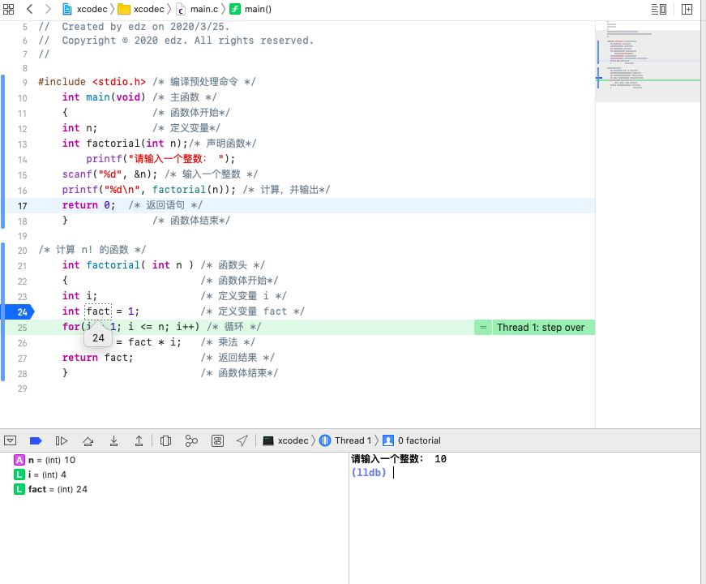

# **笔记&作业3.26**

## **.gitignore**

```c
# blacklist everything
* 

# whilelist all directories
!*/
# whitelist the file you're interested in
!*.c
!*.h
!.gitignore
```

.gitignore 对所在的目录及子目录都有效

## **换行符**

printf("hello world\n")  输出为

hello world后换行

printf("hello\n world\n")  输出为

hello

 world

**注意world前出现了一个空格**

## **整数算数运算**

整数除整数，结果为整数

- 如：1/2 ＝ 0，9/4 ＝ 2 

■ 没有四舍五入

- 5 * (fahr - 32) / 9 和 5 / 9 * (fahr - 32) 等价吗？右边结果为0，主要是定义了是整型

## 常用数学库函数**

- 平方根函数 sqrt(x)

- 绝对值函数 fabs(x)

fabs(-3.56) 的值为3.56

- 幂函数 pow(x, n) ：xn

pow(1.1, 2) 的值为1.21（即1.12） 

- 指数函数 exp(x)：ex

exp(2.3) 的值为e2.3

- 以e为底的对数函数 log(x)：ln x

log(123.45) 的值为4.815836

- 以10为底的对数函数 log10(x)：log10

## **几个语言的区别**

解释型：shell python

面向对象：java

面向过程： c，是为了解决一个问题，实现一个功能


## **作业一：**

**xcode断点执行界面：**




**计算100！结果显示为0的原因：**100的阶乘是一个十分庞大的数字 , 已经超过了C语言数据类型所能表示的最大数字