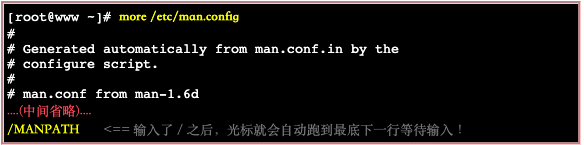

# **Linux 的文件与目录管理** 3.14

## **ls -la**

- 第一个字符代表这个文件是『目录、文件或链接文件等等』：
    - 当为[ d ]则是目录，
    - 当为[ - ]则是文件
    - 若是[ l ]则表示为连结档(link file)；
    - 若是[ b ]则表示为装置文件里面的可供储存的接口设备(可随机存取装置)；
    - 若是[ c ]则表示为装置文件里面的串行端口设备，例如键盘、鼠标(一次性读取装置)。
- 接下来的字符中，以三个为一组，且均为rwx 的三个参数的组合。其中，[ r ]代表可读(read)、[ w ]代表可写(write)、[ x ]代表可执行(execute)。补充：无x权限则不可以使用cd命令进入该目录。 要注意的是，这三个权限的位置不会改变，如果没有权限，就会出现减号[ - ]而已。
    - 第一组为『文件拥有者的权限』，以『install.log』那个文件为例， 该文件的拥有者可以读写，但不可执行；
    - 第二组为『同群组的权限』；
    - 第三组为『其他非本群组的权限』。

如果想要显示完整的时间格式，可以利用ls的选项，亦即：『ls -l --full-time』就能够显示出完整的时间格式了！包括年、月、日、时间喔。 

***
## **如何改变文件属性与权限**
- chgrp ：改变文件所属群组
- chown ：改变文件拥有者
- chmod ：改变文件的权限, SUID, SGID, SBIT等等的特性

具体看[鸟哥linux](http://cn.linux.vbird.org/linux_basic/0210filepermission.php#ex)
------

## **Linux文件扩展名：**

- *.sh ： 脚本或批处理文件 (scripts)，因为批处理文件为使用shell写成的，所以扩展名就编成 .sh ；
- *Z, *.tar, *.tar.gz, *.zip, *.tgz： 经过打包的压缩文件。这是因为压缩软件分别为 gunzip, tar 等等的，由于不同的压缩软件，而取其相关的扩展名啰！
- *.html, *.php：网页相关文件，分别代表 HTML 语法与 PHP 语法的网页文件啰！ .html 的文件可使用网页浏览器来直接开启，至于 .php 的文件， 则可以透过 client 端的浏览器来 server 端浏览，以得到运算后的网页结果呢！

------

## **相对路径与绝对路径：**

- 绝对路径：路径的写法『一定由根目录 / 写起』，例如： /usr/share/doc 这个目录。

- 相对路径：路径的写法『不是由 / 写起』，例如由 /usr/share/doc 要到 /usr/share/man 底下时，可以写成： 『cd ../man』这就是相对路径的写法啦！相对路径意指『相对於目前工作目录的路径！』

## **文件内容查阅：**

- cat 由第一行开始显示文件内容
- tac 从最后一行开始显示，可以看出 tac 是 cat 的倒著写！
- nl  显示的时候，顺道输出行号！
- more 一页一页的显示文件内容
- less 与 more 类似，但是比 more 更好的是，他可以往前翻页！
- head 只看头几行
- tail 只看尾巴几行
- od  以二进位的方式读取文件内容！

**more (一页一页翻动)**

仔细的给他看到上面的范例，如果 more 后面接的文件内容行数大於萤幕输出的行数时， 就会出现类似上面的图示。重点在最后一行，最后一行会显示出目前显示的百分比， 而且还可以在最后一行输入一些有用的命令喔！在 more 这个程序的运行过程中，你有几个按键可以按的：

- 空白键 (space)：代表向下翻一页；
- Enter     ：代表向下翻『一行』；
- /字串     ：代表在这个显示的内容当中，向下搜寻『字串』这个关键字；
- :f      ：立刻显示出档名以及目前显示的行数；
- q       ：代表立刻离开 more ，不再显示该文件内容。
- b 或 [ctrl]-b ：代表往回翻页，不过这动作只对文件有用，对管线无用。

要离开 more 这个命令的显示工作，可以按下 q 就能够离开了。而要向下翻页，就使用空白键即可。 比较有用的是搜寻字串的功能，举例来说，我们使用『 more /etc/man.config 』来观察该文件， 若想要在该文件内搜寻 MANPATH 这个字串时，可以这样做：

如同上面的说明，输入了 / 之后，光标就会跑到最底下一行，并且等待你的输入， 你输入了字串并按下[enter]之后，嘿嘿！ more 就会开始向下搜寻该字串罗～而重复搜寻同一个字串， 可以直接按下 n 即可啊！最后，不想要看了，就按下 q 即可离开 more 啦！

## **重点回顾**

- 绝对路径：『一定由根目录 / 写起』；相对路径：『不是由 / 写起』

- rmdir 仅能删除空目录，要删除非空目录需使用『 rm -r 』命令；

- cat -n 与 nl 均可显示行号，但默认的情况下，空白行会不会编号并不相同；

- ouch 的目的在修改文件的时间参数，但亦可用来创建空文件；

- 观察文件的类型可以使用 file 命令来观察；

- type命令其实不能算查找命令，它是用来区分某个命令到底是由shell自带的，还是由shell外部的独立二进制文件提供的。如果一个命令是外部命令，那么使用-p参数，会显示该命令的路径，相当于which命令。

  type命令的使用实例：**type cd**
- which命令的作用是，在PATH变量指定的路径中，搜索某个系统命令的位置，并且返回第一个搜索结果。也就是说，使用which命令，就可以看到某个系统命令是否存在，以及执行的到底是哪一个位置的命令。
which命令的使用实例: **which grep**
- locate命令其实是“find -name”的另一种写法，但是要比后者快得多，原因在于它不搜索具体目录，而是搜索一个数据库（/var/lib/locatedb），这个数据库中含有本地所有文件信息。Linux系统自动创建这个数据库，并且每天自动更新一次，所以使用locate命令查不到最新变动过的文件。为了避免这种情况，可以在使用locate之前，先使用updatedb命令，手动更新数据库。
locate命令的使用实例：**locate /etc/sh**
- whereis命令只能用于程序名的搜索，而且只搜索二进制文件（参数-b）、man说明文件（参数-m）和源代码文件（参数-s）。如果省略参数，则返回所有信息。
whereis命令的使用实例:**whereis grep**
- 搜寻命令的完整档名可用 which 或 type ，这两个命令都是透过 PATH 变量来搜寻档名；
- 搜寻文件的完整档名可以使用 whereis 或 locate 到数据库文件去搜寻，而不实际搜寻文件系统；
- 利用 find 可以加入许多选项来直接查询文件系统，以获得自己想要知道的档名。